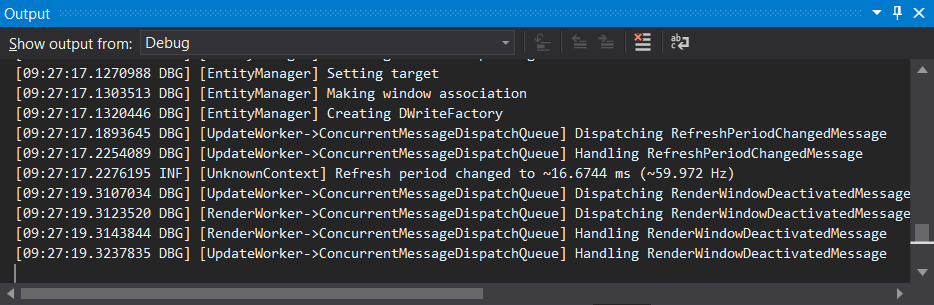

# Logging

[Serilog](https://serilog.net) is a popular logging framework for .NET applications. The engine uses Serilog for all logging. Serilog provides the following log levels, ordered by least severe to most severe:

- Verbose
- Debug
- Information
- Warning
- Error
- Fatal

## Log levels

The default minimum log level is `Information`. All log messages at levels less severe than the desired level are discarded.

## Log destinations

The default log destination is the Debug stream provided by the Visual Studio debugger. Log output will be visible under the Debug category in the Output window.

## Command line parameters

See [Command Line Parameters](command-line-parameters.md) for more information about configuring logging.
