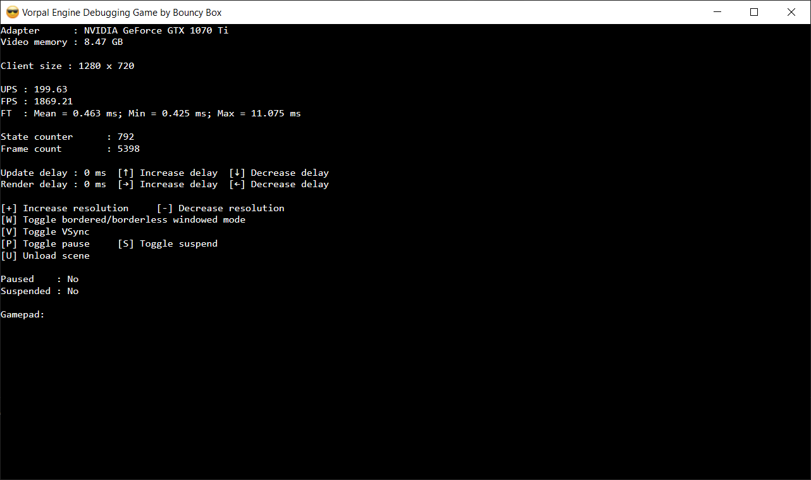

# Vorpal Engine

## Build status

I haven't added automated build support yet.

## What is Vorpal Engine?

I've dabbled with game engines many times over the years, but I was never happy with using C++ for them. I'm always far more productive using C# and .NET. Recently, drastic improvements in C# and .NET--specifically C# 8.0 and .NET Core 3.x--have allowed me to once again attempt a game engine in C# and .NET.

Vorpal Engine is that attempt. For now it will be a 2D engine due to my relative lack of interest in designing 3D games from scratch (use a commercial engine for 3D games!) I'll eventually use the engine to write a game of some kind.

This engine is really just a hobby project at this time. I don't have any grand plans for it and I don't plan on commercializing it.

## What is Bouncy Box?

Bouncy Box is my not-yet-registered LLC. You'll see this name references in various namespaces and other artifacts. For now it's synonymous with my person. This name is subject to change.

## Detailed Documentation

See the [docs](docs/readme.md) folder.

## Engine requirements and recommendations

- Windows 10
- A GPU that supports DirectX 11
- A keyboard
- A gamepad that supports XInput or can be mapped to XInput with an application like [DS4Windows](https://ryochan7.github.io/ds4windows-site/)

## Software development requirements and recommendations

- [Visual Studio 2019](https://visualstudio.microsoft.com/vs/)
- [ReSharper](https://www.jetbrains.com/resharper/)

## Sample "games"

### `DebuggingGame`

`DebuggingGame` is used mainly to exercise the `Game` class and to report engine statistics. This project has proven very useful to help me visualize what's going on inside the engine.

### `SampleGame`

`SampleGame` is intended to be a "real" game in the sense that it exercises more of the engine's capabilities than `DebuggingGame`.

## Code documentation

I am trying to be very thorough about documenting my code, both with XML documentations and comments.

## Code hygiene

I use ReSharper to keep the code consistently styled and formatted. The settings I use are included in a solution-wide settings file that lives next to the solution. I actively maintain my ReSharper subscription so I'm always using the latest GA release.

You may notice comments and attributes throughout the code that reference ReSharper; these comments and attributes hide suggestions and warnings that would otherwise interfere with my development experience.

## Contributions

I'm not accepting pull request contributions at this time as I simply lack the time to treat this as an "official" open source project. You are free to peruse the code and fork at your leisure. Feel free to contact me directly if you want to discuss bugs or possible improvements.

## Contacting me

Find me on the [C# Discord server](https://discord.gg/csharp). My username is `NathanAldenSr#2130`.

## Acknowledgements and thanks

I couldn't have gotten this far this without the help of the very kind and super-intelligent and experienced folks on the two Discord servers I mentioned above. Special thanks goes out to Tanner Gooding for his amazing efforts on `terrafx.interop` and his willingness to answer my seemingly endless questions.
